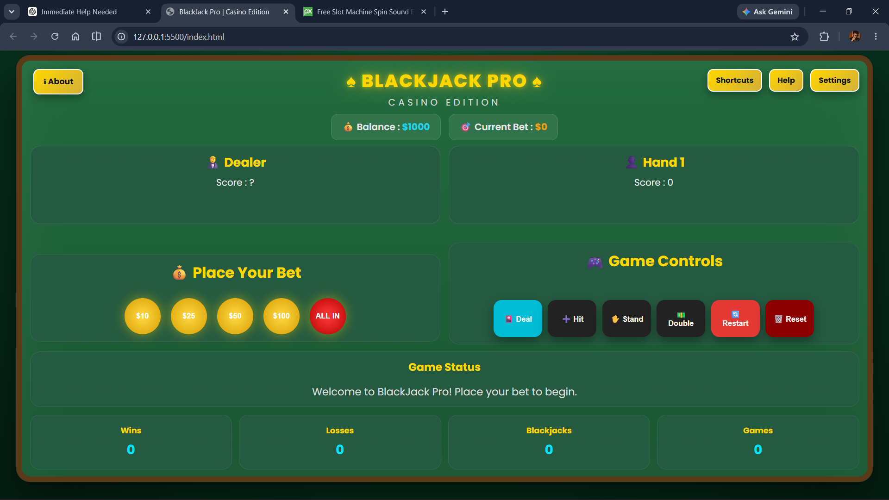
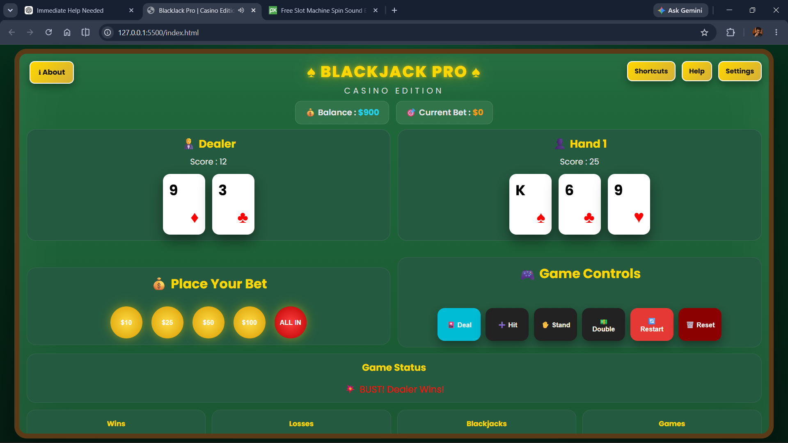

# 🎰 Blackjack Pro – Casino Edition

A modern, feature-rich Blackjack game built with **HTML**, **CSS**, and **Vanilla JavaScript**.

> Experience authentic casino gameplay with advanced features like Split, Double Down, Insurance, Surrender, Statistics, Sound Effects, Save Progress, Keyboard Shortcuts, and a fully responsive interface.


A feature-rich Blackjack game built using **HTML**, **CSS**, and **Vanilla JavaScript** with a modern casino-inspired interface.



## 🌐 Live Demo

> https://theerthananda.github.io/Blackjack-Pro-Casino-Edition/

## ✨ Features

- 🎴 Complete Blackjack gameplay
- 💰 Betting System
- ✂️ Split
- 💵 Double Down
- 🛡️ Insurance
- 🏳️ Surrender
- 🔊 Sound Effects
- 💾 Auto Save Progress
- 📊 Game Statistics
- ⌨️ Keyboard Shortcuts
- ⚙️ Settings Panel
- ❓ Help Section
- ℹ️ About Section
- 📱 Fully Responsive Design

## ⌨️ Keyboard Shortcuts

| Key | Action |
|-----|--------|
| **H** | Hit |
| **S** | Stand |
| **D** | Double Down |
| **P** | Split |
| **R** | Restart Round |

## 🎮 Gameplay



## 🛠️ Tech Stack

- HTML5
- CSS3
- Vanilla JavaScript (ES6)
- Local Storage API
- Responsive Design

## 📂 Project Structure

```text
Blackjack-Pro-Casino-Edition/
│
├── assets/
│   └── screenshots/
│
├── sounds/
│
├── index.html
├── style.css
├── script.js
├── README.md
└── LICENSE
```
## 🚀 Installation

1. Clone the repository

```bash
git clone https://github.com/Theerthananda/Blackjack-Pro-Casino-Edition.git
```

2. Open the project folder.

3. Run `index.html` in your browser.

Or simply visit the Live Demo.

## 🚀 Future Improvements

- 🎵 Background casino music
- 🏆 Achievement system
- 📈 Advanced player statistics
- 🎨 Additional themes
- 🌐 Multiplayer support

## 👨‍💻 Developer

Developed by **Theerthananda**

🌐 Portfolio: **https://theerthananda.github.io/**

If you like this project, feel free to ⭐ the repository.

## 📄 License

This project is licensed under the **MIT License**.

See the [LICENSE](LICENSE) file for more details.

---

⭐ If you enjoyed this project, don't forget to **Star** the repository!

